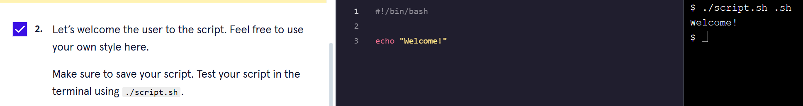
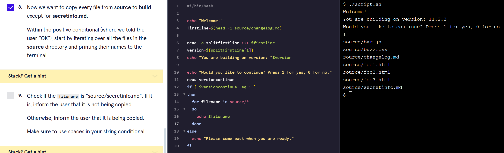

# Codecademy_Build_a_Build_Script
## In this project, I am creating a release script to copy certain files from a source directory into a build directory.

* The instructions can be found on https://www.codecademy.com/courses/introduction-to-linux/projects/bash-scripting-p.

1. We start by adding in the header in order to make the script read Bash.

2. We then create a greeting to the user.

3. We want to verify the version of the changelog.md file so we read the first line of the file using the head command into the variable firstline.

4. Afterwards, we only want the version number without the markdown formatting so we use the read command to split the string into an array using the -a option.

5. We set the value of the version of the script which is located at index 1 of the array. We save it to the variable version and print a statement notifying the user which version they are building on.

6. Now we give the user the opportunity to exit the script in case they want to update the version of the build. They will enter 1 to continue or 0 to exit and their response is assigned to variable versioncontinue.

7. We now add a conditional: if the user enter one, print "OK". If not, print "Please come back when you are ready."

8. Replace the "OK" statement and print out all of the files that are located in the source directory.

9. Of the filenames, check to see if one of them is called source/secretinfo.md and if there is, print a statement that says "This file will not be copied." For the other files, print out "This file will be copied."

10. Copy all of the files in the source directory except for secretinfo.md using the if and else statement.

11. Outside of the for loop, we will change directories to build and print a statement that says so and then another cd command to change back to the home directory.

12. Finally notify the user of the version that they are building on and list out all of the files in the build directory.

