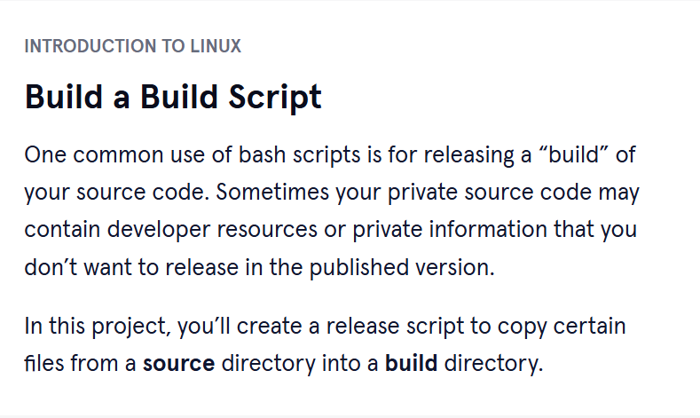

# Codecademy_Build_a_Build_Script
## In this project, I am creating a release script to copy certain files from a source directory into a build directory.

* The instructions can be found on https://www.codecademy.com/courses/introduction-to-linux/projects/bash-scripting-p.

1. We start by 
